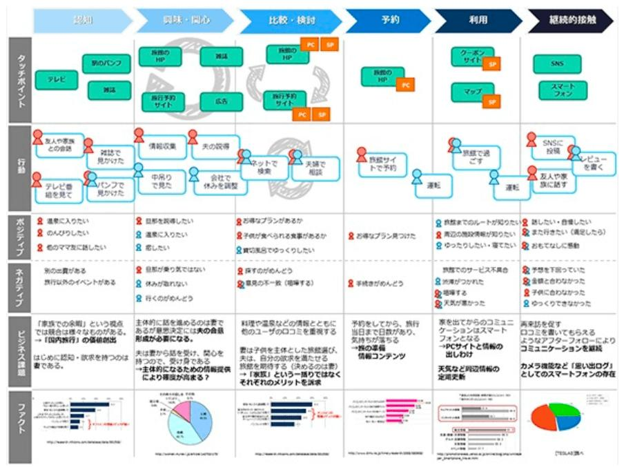

## IT(顧客中心設計)を活かす

### 正しいIT化へのアプローチ 　

IT、またはICTは、Information (and Communications) Technologyの略だがそのままで日本語になっている。ICTという言い回しは官庁や自治体などでよく耳にするが、やや正規な表現を主張しているかに聞こえないこともない。霞ヶ関や海外では"IT"では通じないよ、などと言う人もいる。いずれにしても意味に大差はなく本稿では”IT”という個人的に耳慣れした単語を使うことにする。 　

ITの（またはICTの）活用とかIT化とかいうと、その導入本や解説本の多くは「情報システム」の専門用語の説明から入る場合が多いように思う。"システム"とは何か、いかなる”アーキテクチャ”か、どんな”テクノロジ”で構成されているか、など、ITの専門家、システムデザイナーやシステムエンジニア、ITベンダーのマスターベーションに聞こえる。ITの利用者（ユーザ）にとってはそんなことより、どんな"効能"があるのか、”使い勝手”や”安全性”はどうなのか知りたいのに、ITの専門家（IT屋）は「それを示すのは難しいですね」と片ずけてしまう。これは多くの情報システムが、複雑で専門的で一般人に説明困難で、さらに成果にかかる条件が多岐で、その上ユーザの使用感や効能を把握する仕組み自体を欠いているからである。IT業界では未だに多くのシステム開発が（例えば一連のコロナ対策システムなど）、成果主義ではなく工数精算方式で報酬が決まるからだ。採用された新技術や開発の生産性などシステム開発内部の仕組みにフォーカスし、ユーザのフィーリングや業務改善に着目しない体質みたいなものがIT屋に染み付いているように思える。ITの利用者（ユーザ）はそれに乗ってはいけない。アプリケーションソフトの開発設計や、複雑怪奇なITプロダクトの購入検討の前に、行うべきことがある。大切なのは"ビジネスモデル"であり、”データ”であり、（ユーザの）顧客の”フィーリング”である。 　

実は最新のシステム開発やソフト開発の最上流に、このようなビジネスの仕組みや顧客接点やマーケティングを検討する手法がちゃんと用意されている。この工程を無視すると実はとんでもないことに陥りやすいのにも関わらず、ユーザのIT専門部門や似非プロフェッショナル達はこの上流工程を端折ったりITに疎いシステムの最終利用者（ビジネス部門）に放任したりしている。 　

本来、新しいビジネスモデルをどう考案し、デジタル化されたデータをどう活用し、ビジネス/サービスの目的（自動化や顧客満足向上など）をどこまで達成するか、が勝負の決め手なのに、ユーザがIT屋の甘言に翻弄されてこれらを見失うと、単にコードを入れただけの精度と効率のない”入れポン”システム（どこかの接種券予約システムみたいな）が出来てしまう。多くの場合、その下流作業を担う現場では、結局紙と手作業という非効率に陥ってしまう。現場にまともなバーコードリーダーもないのに、いたずらに今回限りの新コード(!)を採番し、現場受付では利用もせず、実績登録も手打ちに陥って何千万という非効率を作り出してしまう。　　

そんなことにならないようにユーザは、まず自らのビジネス/サービスの本質的な問題点や改革点を探し出してシステム化の目標に据えて、その成果を測定できるデータを見つける努力をしなければならない。既存業務プロセスで非効率で無意味な作業は何か、業務の中心にあるデータは何か、顧客に価値あるデータが発見されたり、創造できるチャンスがないか、を精査しなければならない。そしてどうあるべきか（あるべき姿）を熟考、自問、再考するのだ。最新の(IT)工学ではこれらの最上流設計手法を「顧客中心設計」と呼んでいる。伝統的にマーケティング力のある企業では、新製品/サービスを開発する際にこの設計工程を必ず実施している。この場合、システム化の対象や目的はその過程で出てくる一部の新しいツールや武器でしかない。テクノロジ崇拝の技術屋ばっかりのITベンダーにはこのノウハウはない。業務と顧客を理解しているユーザやマーケッターが製品/サービス戦略やIT活用を考える時、顧客中心のデータ中心のこのアプローチが有効だと思う。　　

### 顧客中心設計とは  

この設計手法はお気付きの通り、IT化やシステム化以外の目的、例えばビジネスプロセスの開発や改善、業務プロセスの設計や改善、顧客とのリレーションやマーケティング戦略の検討に使うことも出来る。事実、製品設計やシステム設計の上流として考案されたこの手法が、今日では多くのマーケティングコンサルに利用されている。筆者もクラウドサービスの上流設計で、多くのIT屋が機能/非機能設計から入るのに対して反論してくれた工学系の大学教授らに紹介を受けた。モノ造り日本が躓きを見せた時、品質と機能設計ばかり追い続けていた工学系の学者連中がたどり着いた生き残りのための変換点だったようだ。過剰品質の日の丸製造業が、モノからコト造り（顧客の経験価値にまずフォーカスする）にシフトした欧米企業に勝てなくなった反省の産物とも言えないこともない。 　

顧客中心設計で最もフォーカスするのは、顧客の体験である。英語で Customer (/User) Experienceという(CXとかUXとか略す)。顧客がどの様な行動をしどう感じ何を体験したのか、そしてそこにどの様な価値が創出出来るか考える姿勢を、顧客経験価値志向などと言う。自社の製品・サービスを発想の中心に置きがちなシーズ思考と明確に決別して、徹底して取引前から取引終了までの全ての時間での顧客の行動と感情に集中する。そして、その顧客の行動と感情のいちいちと、サービスの提供者との接触、コミュニケーション、関係性を時系列で詳（つまび）らかにすることで、サービスの全体像と問題点を描ききる。いわば（製品）サービスに関わる顧客の全旅程の見える化である。この作業は通常サービスを設計するチームが専門家（マーケティングコンサルタント）の支援を得て、製品・サービス設計の上流で実施するが、ここではより実践的で簡易なやり方を紹介しよう。　　

#### 顧客をプロファイリングする

まず顧客のプロファイリングである。あらゆる教科書やガイドやコンサルがすべからくこれを出発点としている。できれば先入観を捨てて、顧客（マーケット）を大きく捉え、その属性（年齢、性別、住所など）、その特性（所得、心理、他社顧客/自社顧客、行動など）で分類してターゲットを決める（セグメント化という）。 　

##### 顧客リサーチとペルソナ策定

これには調査（リサーチ）が必要かもしれない。地理的な平均年収や持家比率の分布、家族構成や所得調査（国勢調査？）、民間や銀行の顧客意識調査など、入手可能な情報もあるだろう。そこでは、横浜市在住より鎌倉市在住の方が、年齢層も高く財産持ちという傾向が発見できるかもしれない。地方より周辺都市部の方が顧客の流出入とディベロッパーが纏めている不動産の新規購入客の集団が多いかもしれない。選別と特定ができても、オケラみたいなピーピーの顧客層もいるかもしれない。反対に金払いの良い集合が存在するかもしれない。ここの選択で後の結果が相当変わる。目の付け所がよければ後の打率が良いし、外れればペンペン草だ。 　

そして、目を付けたセグメントにコンタクト手段はあるのか、儲かる相手なのか、競合や既存ベンダーが囲い込んでいないかなど、選別・特定できたセグメント（顧客層）のスクリーニング（精査と評価）も重要だ。対象の製品・サービスごとに、選別・特定できる顧客層はおそらく異なるだろう。複数のセグメンテーションができるかもしれない。そうそうサプライズはないが、何か時代の趨勢や最近のトレンドが発見できれば、近い将来の有力マーケットにフォーカスできるかもしれない。 　

顧客のセグメントがおおよそ固まった段階で、あらためてそのセグメントに典型的な個人の属性と特性を書き出しておく。どういう人物（属性）なのか、どんな嗜好や特徴や傾向があるのか、どこで接触できるのか整理する。これを”ペルソナ策定”などと顧客中心設計では呼んでいる。 　

##### 登場人物の特定

ペルソナ策定が出来たらここで、顧客の周辺関係を洗っておこう。顧客本人を取り巻く社会的関係の概略を押さえていくのだ。不動産業や信託銀行とコネがあるのか、地域のケアマネや福祉施設と関係があるのか、保有会社の税理士や社労士など士業との関係を持っているのか、特定したペルソナに固有の傾向が発見できればその”筋”が活用できるかもしれない。傾向がなくても、その前提を置くことでリーチ可能になるかもしれない。そしてあなた（サービス提供者）との距離やさらに業務で関わりのある関係団体（裁判所、登記所、福祉課など）も整理しマップできれば、顧客の社会関係（人脈）と、サービス提供者への接触ルートや業務での登場人物（団体）が整理できるだろう。これらの登場人物（顧客の関係者と業務の関係者）は、次のカスタマージャーニマップ作成の縦軸になっていく。 　 　

##### 参考　顧客周辺にいる事業者・団体と業務関係者（想定例）　　

士業(弁護士、社労士、税理士、行政書士)、銀行、不動産業、ケアマネ、保健所、病院・療養施設、老人ホーム、ディベロッパー、ホームビルダー(設計工務店)、裁判所、警察、自治会（福祉課）、老人会、商工会議所、ライオンズクラブ、中小企業庁　　

#### カスタマージャーニーマップを描く

次の作業は表（マトリックス/マップ）での整理になる。表の横軸はセールスからサービス提供とフォローアップまでの時間軸（ステップ/フェーズ）、縦軸は登場人物とその行動と感情になる。※以下例を図示するが著作権を無視した無許可転載なので見たら削除するので連絡してください。 　

マップの横軸は顧客が、①見込み客（認知・注意・興味）から②有力プロスペクト（紹介・説明・説得）を経て、③サービス受益者（契約・サービス提供）になり、④アフターサービス（フォローアップ・保守）に至る工程（ステップ/フェーズ）を示している（ライフサイクルと言う）。 　

縦軸はまず①顧客のペルソナ（上記例にはない）、②行動、③感情（ポジティブ、ネガティブ）のセットがあり（タッチポイントは通常次に出て来る）、次に④顧客の有力な関係者群（士業・銀行・不動産などグルーピングできればいいが）の顧客への接触方法（タッチポイント：広告宣伝、Web、電話、説明会、往訪、ファックスなど）、⑤対応した行動（査定見積、裁判所に出頭など）、⑥その行動時の感情（喜び、怒り、苛立ち、うんざりなど）、のセットがあり、次に⑦あなた（サービス提供者）の顧客との接触手段（タッチポイント：同席、個別訪問、メール、郵送など）と、⑧とるべき行動（士業に同行/代行、サービス紹介、見積、資料収集など）、⑨業務関係者への接触手段（電子申請、郵送、出頭など）と続く（例には顧客のセットしかないが実用的でない）。　　

この縦横の表（カスタマージャーニーマップ）では、各欄を利用し”まず現状”を整理する（あるべき姿ではない）。接触方法が現状ファックスであったらファックスと書く。ファックスのない顧客もあれば郵送とも書く。ある程度想像や思い込みでもラフに整理し精度（正確性）は問わないのがコツだ。例えばペルソナ策定が「年少の子供を持って人生で最初に山手のマンションを購入する30代の世帯主」だった場合、マップのスタートをマンション選定段階にしても良いし購入契約時のローン検討段階にしても良い。あなた（サービス提供者）の提供業務をイメージして決めればよい。サービス提供者が顧客と直接の接触が困難な場合、関係者（ディベロッパーか銀行か）のタッチポイントの利用可否が検討できるように、あなたより顧客に距離の近い関係者の接触方法を研究し記入する。そして関係者がその行動（説明会とか）で遭遇する感情（基本的な質疑や書類不備の顧客が多く面倒だ、など）の改善や強化に関われるか後から考えられるように、該当欄（⑥）にメモして行く。　　

もちろんフェーズ毎に顧客と関係者の④タッチポイントと⑤行動は変化するだろう。それに対してサービス提供者の⑦接触手段と⑧行動も変化するだろう。顧客の行動（ジャーニー）に注目し、それぞれの時点での満足と不満足、サプライズやデライト、怒りや苛立ちを測定（類推）できれば、顧客への接触方法の改善やシステム化、情報提供や利便性の提供（待ち時間のお知らせや短縮など）のアイディアでアドバンテージが取れるだろう。同様に関係者の感情が把握できれば、サービス提案や業務代行の切り口が整理できるだろう。さらにバックヤードとしての⑨業務関係者への接触手段に非効率があれば、それ自身システム化のターゲットになるかもしれない（自動化とか）。カスタマージャーニーマップの最後の数行には、これらの改善ポイント（例では「ビジネス課題」になっている）をフェーズ毎に思いつくままプロットしていく。　　

カスタマージャーニーマップを作成する目的は、一義的には正にそれら（日常コミュニケーションや業務改善と顧客や関係者への訴求ポイントの発見）にあるが、IT化という観点ではこれらの行動やコミュニケーションの現場で採取できる顧客データの収集（データポイントの発見）という意義もある。AmazonやFaceBookでは、Web上での顧客の振る舞い（参照やページ戻り、躊躇や中断など）をデータポイントとして収集し解析して顧客Web行動を購買や目的の行動まで誘導する手段や適時適切な広告効果の測定を達成している。そこまで詳細で陰湿でなくても、例えばシンガポールのチャンギ空港の税関・入国出口で利用客に5段階のニコちゃんマークのボタンを押させているし、流通や医療関係でも窓口での待ち時間と顧客満足度との関係を測定している。カスタマージャーニーマップの一番最後に、IT化やデジタル化の介入ができるポイントと採取可能なデータ内容を書く欄を設け、IT化の重要な目的の１つとして書き出しておく。 　

カスタマージャーニーマップは、通常複数のメンバーでツールや模造紙上にポストイットで各自自由にプロットし都度都度ブレインストーミング風に整理していく。参加者のいない場合は、顧客調査や関係者問診などのテストマーケティングを挟んで複数回に渡ってチューンしていくしかない。大切なのは正確性より気付きだ。チームでも個人でも否定的な発想（そんなの出来ないとか）は厳禁だ。顧客と関係者の行動・感情の起伏と（コンタクト/データ）ポイントの理解を深めてサービスの設計・改善に活かすアイディアを発想する機会創出に利用する。 　

アイディアの発想法を教える研究も相当数あるがかなり難解だ。”改良”、”排除”、”代替”、”流用”などの概念を新発想のきっかけに利用しながら、寝ても醒めても自問自答するしかない。

#### ツール化やシステム化を考える

顧客との接触方法や課題の解決方法が発見・発想出来たら、それがシステム化出来ないか考えよう。ITがストレートに利用できればベストであろうが、最低でもプロセス化、パターン化、手法化出来ないか検討し、顧客やその関係者の問題解決（省力化/省人化/効率化/品質向上/スピードアップなど）として理路整然と説明できるようにする。

メッセージングFAB（Feature、Advantage、Benefit）  
メディア・チャネル　　
顧客データ　　

