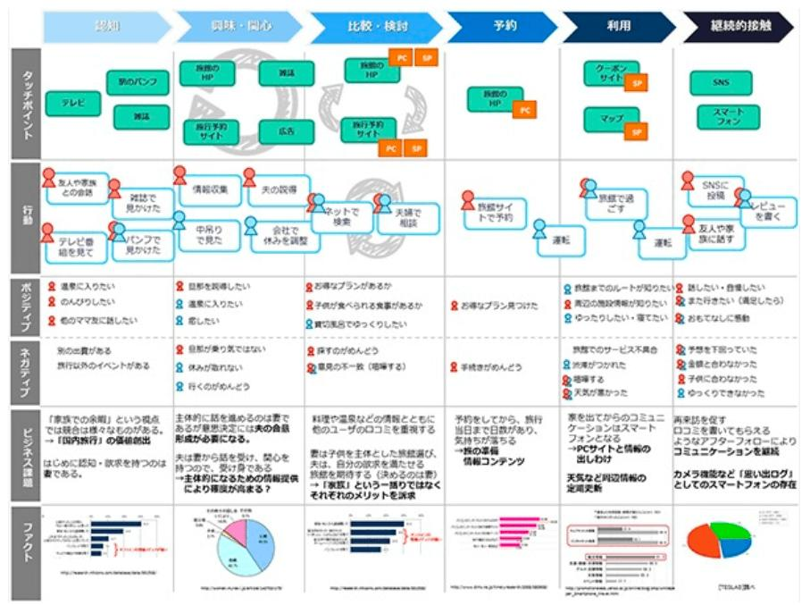

## 仕事にITを活かす

### 正しいITへのアプローチ 　

IT、またはICTは、Information (and Communications) Technologyの略だがそのままで日本語になっている。ICTという言い回しは官庁や自治体などでよく耳にするが、やや正規な表現を主張しているかに聞こえないこともない。霞ヶ関や海外では"IT"では通じないよ、などと言う人もいる。いずれにしても意味に大差はなく本稿では”IT”という個人的に耳慣れした単語を使うことにする。 　

ITの（またはICTの）活用というと、その導入本や解説本の多くは「情報システム」の専門用語の説明から入る場合が多いように思う。"システム"とは何か、いかなる”アーキテクチャ”か、どんな”テクノロジ”で構成されているか、など、ITの専門家、システムデザイナーやシステムエンジニア、ITベンダーのマスターベーションに聞こえる。ITの利用者（ユーザ）にとってはそんなことより、どんな"効能"があるのか、”使い勝手”や”安全性”はどうなのか知りたいのに、ITの専門家（IT屋）は「それを示すのは難しいですね」と片ずけてしまう。これは多くの情報システムが、複雑で専門的で一般人に説明困難で、さらに成果にかかる条件が多岐で、その上ユーザの使用感や効能を把握する仕組み自体を欠いているからである。IT業界では未だに多くのシステム開発が（例えば一連のコロナ対策システムなど）、成果主義ではなく工数精算方式で報酬が決まるからだ。採用された新技術や開発の生産性などシステム開発内部の仕組みにフォーカスし、ユーザのフィーリングや業務改善に着目しない体質みたいなものがIT屋に染み付いているように思える。 　

ならばユーザはITにどうアプローチすればいいのだろうか。もちろん専門用語やシステムアーキテクチャに精通してるに越したことはないが、大切なのは"ビジネスモデル"であり、”データ”であり、（ユーザの）顧客の”フィーリング”であろう。導入/開発される情報システムが、新しいビジネスモデルをどう支援し、デジタル化されたデータをどう活用し、ビジネス/サービスの目的（自動化や顧客満足向上など）を達成するか、が勝負の決め手なのだ。ユーザがIT屋の甘言に翻弄されてこれらを見失うと、単にコードを入れただけの精度と効率のない”入れポン”システム（どこかの接種券予約システムみたいな）が出来てしまう。多くの場合、その下流作業を担う現場では、結局紙と手作業という非効率に陥ってしまう。現場にまともなバーコードリーダーもないのに、いたずらに今回限りの新コード(!)を採番し、現場受付では利用もせず、実績登録も手打ちに陥って何千万という非効率を作り出してしまう。　　

そんなことにならないようにユーザは、まず自らのビジネス/サービスの本質的な問題点や改革点を探し出してシステム化の目標に据えて、その成果を測定できるデータを見つける努力をしなければならない。既存業務プロセスで非効率で無意味な作業は何か、業務の中心にあるデータは何か、顧客に価値あるデータが発見されたり、創造できるチャンスがないか、を精査しなければならない。そしてどうあるべきか（あるべき姿）を熟考、自問、再考するべきだ。　　

もちろんこの様な努力が実を結ぶとは限らない。IT化に向かないケースもあるかもしれない。顧客や関連組織のデータがアナログ（紙や音声）だらけで、システム化の話にならないかもしれない。しかし顧客の行動、業務プロセス、顧客の感情、測定可能データ、関連するツールやシステムの関係を整理することは大切だ。その整理の中で小さな発見や新しいアイディアが発想され得るからだ。伝統的にマーケティング力のある企業では、新製品/サービスを開発する際にこれらの関係をディスカッションし整理する。システム化はその過程で出てくる新しいツールや武器でしかない。製品/サービスの顧客にフォーカスして行うこの作業を「顧客中心設計」(人間中心設計)などと言う（学問になっている）。テクノロジ崇拝の技術屋ばっかりのITベンダーにはこのノウハウはない。業務と顧客を理解しているユーザがIT活用を考える時、顧客中心のデータ中心のこのアプローチが有効だと思う。　　

### 顧客中心設計とは  

顧客中心設計で最もフォーカスするのは、顧客の体験である。英語で Customer (/User) Experienceという(CXとかUXとか略す)。顧客がどの様な行動をしどう感じ何を体験したのか、そしてそこにどの様な価値が創出出来るか考える姿勢を、顧客経験価値志向などと言う。自社の製品・サービスを発想の中心に置きがちなシーズ思考と明確に決別して、徹底して取引前から取引終了までの全ての時間での顧客の行動と感情に集中する。そして、その顧客の行動と感情のいちいちと、サービスの提供者との接触、コミュニケーション、関係性を時系列で詳（つまび）らかにすることで、サービスの全体像と問題点を描ききる。いわば（製品）サービスに関わる顧客の全旅程の見える化である。この作業は通常サービスを設計するチームが専門家（マーケティングコンサルタント）の支援を得て、製品・サービス設計の上流で実施するが、ここではより実践的で簡易なやり方を紹介しよう。　　

#### 顧客をプロファイリングする

まず顧客のプロファイリングである。あらゆる教科書やガイドやコンサルがすべからくこれを出発点としている。できれば先入観を捨てて、顧客（マーケット）を大きく捉え、その属性（年齢、性別、住所など）、その特性（所得、心理、他社顧客/自社顧客、行動など）で分類してターゲットを決める（セグメント化という）。 　

これには調査（リサーチ）が必要かもしれない。地理的な平均年収や持家比率の分布、家族構成や所得調査（国勢調査？）、民間や銀行の顧客意識調査など、入手可能な情報もあるだろう。そこでは、横浜市在住より鎌倉市在住の方が、年齢層も高く財産持ちという傾向が発見できるかもしれない。地方より周辺都市部の方が顧客の流出入とディベロッパーが纏めている不動産の新規購入客の集団が多いかもしれない。選別と特定ができても、オケラみたいなピーピーの顧客層もいるかもしれない。反対に金払いの良い集合が存在するかもしれない。ここの選択で後の結果が相当変わる。目の付け所がよければ後の打率が良いし、外れればペンペン草だ。 　

そして、目を付けたセグメントにコンタクト手段はあるのか、儲かる相手なのか、競合や既存ベンダーが囲い込んでいないかなど、選別・特定できたセグメント（顧客層）のスクリーニング（精査と評価）も重要だ。対象の製品・サービスごとに、選別・特定できる顧客層はおそらく異なるだろう。複数のセグメンテーションができるかもしれない。そうそうサプライズはないが、何か時代の趨勢や最近のトレンドが発見できれば、近い将来の有力マーケットにフォーカスできるかもしれない。 　

顧客のセグメントがおおよそ固まった段階で、あらためてそのセグメントに典型的な個人の属性と特性を書き出しておく。どういう人物（属性）なのか、どんな嗜好や特徴や傾向があるのか、どこで接触できるのか整理する。これを”ペルソナ策定”などと顧客中心設計では呼んでいる。 　

ペルソナ策定が出来たらここで、顧客の周辺関係を洗っておこう。顧客本人を取り巻く社会的関係の概略を押さえていくのだ。信託銀行とコネがあるのか、地域のケアマネや福祉施設と関係があるのか、保有会社の税理士や社労士など士業との関係を持っているのか、

#### カスタマージャーニーマップを描く

#### システム化を考える
